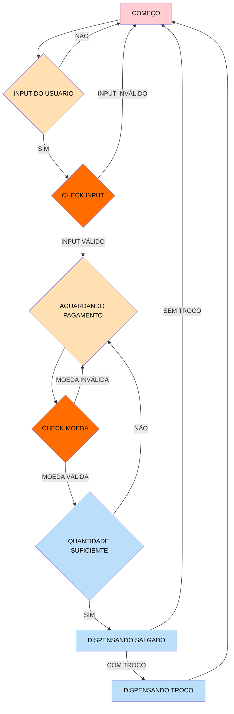

> Um programa codificado em assembly para o simulador Edsim51 que busca implementar o funcionamento de uma maquina de venda de salgadinhos. O programa inicia com uma mensagem mostrando as opções de salgado juntamente com o prçeo de cada um e qual botão deve ser  pressionado para selecionar cada salgadinho. Por meio do teclado, o usuário seleciona entre 4 opções: S1(botão 1 do telcado), S2(botão 2 do telcado), S3(botão 3 do telcado) e S4(botão 4 do telcado). Caso qualquer outro botão tenha sido apertado, a máquina irá aprentar uma mensagem dizendo que essa opção é invalida e o programa repetirá o processo até que uma opção válida tenha sido selecionada.  Depois de selecionar uma opção válida,o motor da edsim se movera para a posição correspondente a do salgado escolhido, após isso, uma mensagem irá aparecer indicando quais botões devem ser pressionados para executar o pagamento, que será por moedas de 50 centavos e 100 centavos(1 real). Qualquer outro botão pressionado não irá afetar em nada o programa. A medida que os botões coreespondentes a 50 centavos e 1 real forem pressionados uma mensagem irá aparecer dizendo qual moeda foi inserida na maquina. O código só irá para quando o valor pago for maior ou igual ao valor do salgado. Caso o valor seja maior, uma mensagem será exibida dizendo qual será o troco que será exibido.  Por fim, haverá uma mensagem avisando que o salgadinho "X" será dispejado da máquina, o motor retornara para sua posição original e assim o programa finaliza.
 

# Configurações antes de começar: 

- Frequência 100 Hz e teclado no modo pulse
 

- Velocidade do motor similar a da imagem abaixo

- Iniciar o teclado: cada endereço recebe um determinado caracter
 

# Fluxograma do projeto

# Textos usados na Main
 

# Funções
- Check_input: O conjunto de subrotinas verifica qual botão o usuário apertou e se o valor está no intervalo de 1 a 4. A subrotina check1 verifica se o botão pressionado é o 1; se não for, chama check2. Esse processo continua até check4, que, caso o botão não seja o 4, chama a subrotina incorreto. Cada subrotina também define o preço do salgado escolhido no registrador R3 e aciona uma subrotina que move o motor para a posição correspondente ao salgado selecionado.
  
  
  
 
- Incorreto: informa a o usuário que ele escolheu uma opção inválida e renicia o código na main
  
   
   
- Ini_lcd: inicia o LCD de 2 linhas por 16 colunas
  
  
  

- Escreve_String: subrotina que escreve uma string inteira
  
  

- Finish: subrotina que retorna outro subrotina
  
 
 
- Envia_caracter: subrotina que coloca o caracter no LCD. O pino RS é ativado para sinalizar ao LCD que o dado enviado é um caractere e o byte mais significativo para os pinos "P1.7" a "P1.4" e  habilita o pino EN para sinalizar o envio do LCD.
  
  
  

- Pos_cursor: Coloca o cursor na posição desejada no lcd

  
  

- Retorna cursor:  move o cursor do display LCD para a posição inicial
  
  

- Clear_display: limpa o display

  
  
  
- ler_teclado : subrotina que verifica se o usuário já apertou algum botão no teclado

- Ver_Coluna: verifica as colunas do telcado
  
   
   
- Pegra_telca: ativa o bit F0 se um botão tiver sido apertado
  
  
  
- Delay: usa um decremento para garantir que subrotinas como Clear_Display funcionem sem erros
  
  

- Exibir_salgados: printa todos salgados e e seus preços
  

- check_moeda1: verifica se a moeda é de 50 centavos usando CJNE entre A que contem a tecla precionada e B que contem o valor '1'. Se não for chama check_moeda2, e se for escreve na tela que o usuario depositou 50 centavos e move 50 para o r7 para que na main ocorra o acumulo dos valores depositados
  
  

- check_moeda2: verifica se a moeda é de 1 real usando CJNE entre A que contem a tecla precionada e B que contem o valor '2'. Se não for chama m_incorreta, e se for escreve na tela que o usuario depositou 1 real e move 100 para o r7 para que na main ocorra o acumulo dos valores depositados
  
  

- m_incorreta: informa o usuario que o botão que ele pressionou não corresponde a uma moeda permitida e volta para o inicio do loop2 na main
  
  

- maior_1: subrotina que verifica se o valor acumulado na hora do pagamento é maior que preço do salgado selecionado. Para isso o valor do preço do salgado é subtraido do valor acumulado com SUBB. Caso haja carry, ele vai para a subrotina menor, já que a existência de um carry indica que o valor acumulado é menor que o preço do salgado. Se o valor for maior que o preço ele move o restante da subtração para o R5 e move o preço do salgado para o acumulador A, para que o loop que recebe o pagamento pare na MAIN
  
  

- menor: subrotina que serve para restaurar o valor do acumulador A para o valor que ele possuiaantes da subtração feita na subrotina maior1

  

- f_troco: subrotina que verifica com CJNE. Se R5 é diferente de 0, existe um valor de troco para devolver e a subrotina mostra_troco é chamada

  
  
 
- mostra_troco: subrotina que mostra no LCD que o programa esta devolvendo o troco e chama a subrotina checa_troco1 para ver qual o valor do troco

  
  
- checa_troco1: subrotina que verifica se o valor no R5 é 100 indicando que o troco é 1 real. Se for ele imprime no LCD "1 real" e se não for ele chama a subrotina checa_troco2

  

- checa_troco2: subrotina que imprime no LCD "50 cents". Ela não faz nenhuma checagem já que o troco só pode ser 1 de 2 valores

  
- Move_S: O conjunto de subrotinas que move o motor para a posição relacionada ao salgado escolhido

  
  
   
  
  

- Volta_motor: subrotina que retorna o motor para sua posição original

  
  
  # MAIN:

  
   
  
    
  
    
  
     
  
   
  
   
  
   
  
   
  
   
  

   

  

